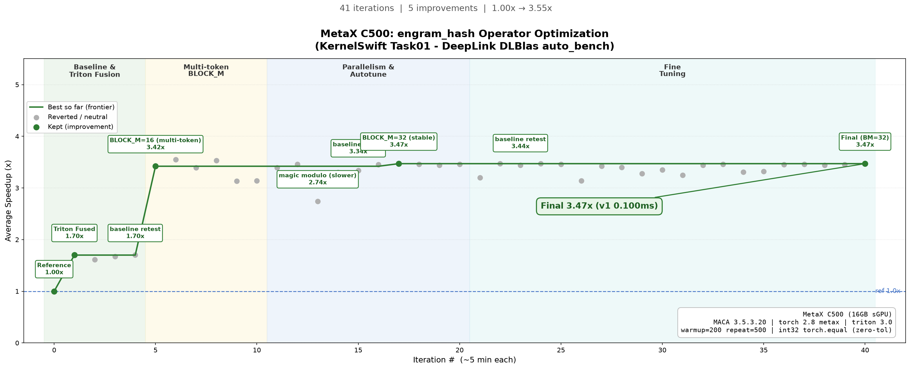
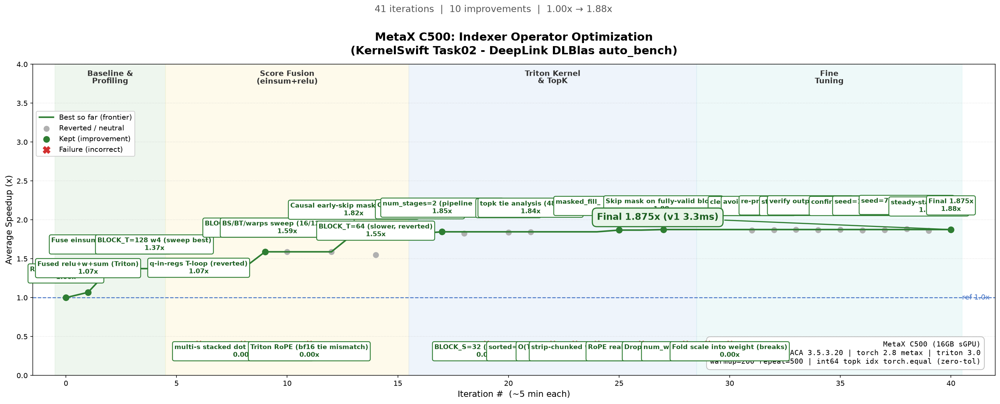
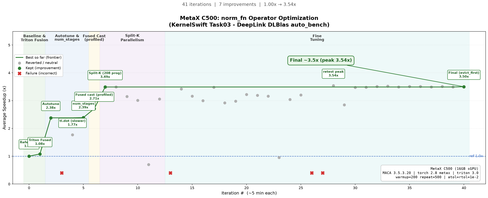

# KernelSwift-MetaX

KernelSwift 赛道二（沐曦 MetaX C500）三个算子的 Triton 优化实现，基于 DeepLink DLBlas `auto_bench.py` 评测（warmup=200 repeat=500，零容差/低容差正确性）。

## 硬件与环境

- MetaX C500（16GB sGPU），MACA 3.5.3.20
- torch 2.8.0+metax，triton 3.0.0+metax，Python 3.12

## 三个任务

| 任务 | 算子 | 最终 Speedup | 关键优化 |
|------|------|-------------|----------|
| Task01 | engram_hash | ~3.47x | Triton 单 kernel 融合 + 多 token BLOCK_M 分块（消除多算子 launch 与中间张量） |
| Task02 | Indexer | ~1.875x | einsum+relu+加权求和+mask 融合成单 kernel + BLOCK_S 分块摊薄 kv 访存 + 因果 early-skip + pipeline |
| Task03 | norm_fn | ~3.5x | Triton 融合 + autotune + Split-K 并行 + evict_first cache 提示 |


## 优化轨迹图

### Task01 engram_hash（~3.47x）


### Task02 Indexer（~1.875x）


### Task03 norm_fn（~3.5x）


## 目录结构

每个任务目录包含：
- `solution.py` — 最终优化解（ModelNew，Triton 算子）
- `reference.py` — torch 基准（Model）
- `ITERATIONS.md` — 逐轮优化日志（含失败路径与原因）
- `iterations.json` — 优化轨迹数据
- `taskXX_progress.png` — 优化轨迹可视化
- `solution_iterN.py` — 各轮次快照

## 评测命令

```bash
python benchmarks/ks/auto_bench.py \
  --v0_file <task>/reference.py \
  --v1_file <task>/solution.py
```
